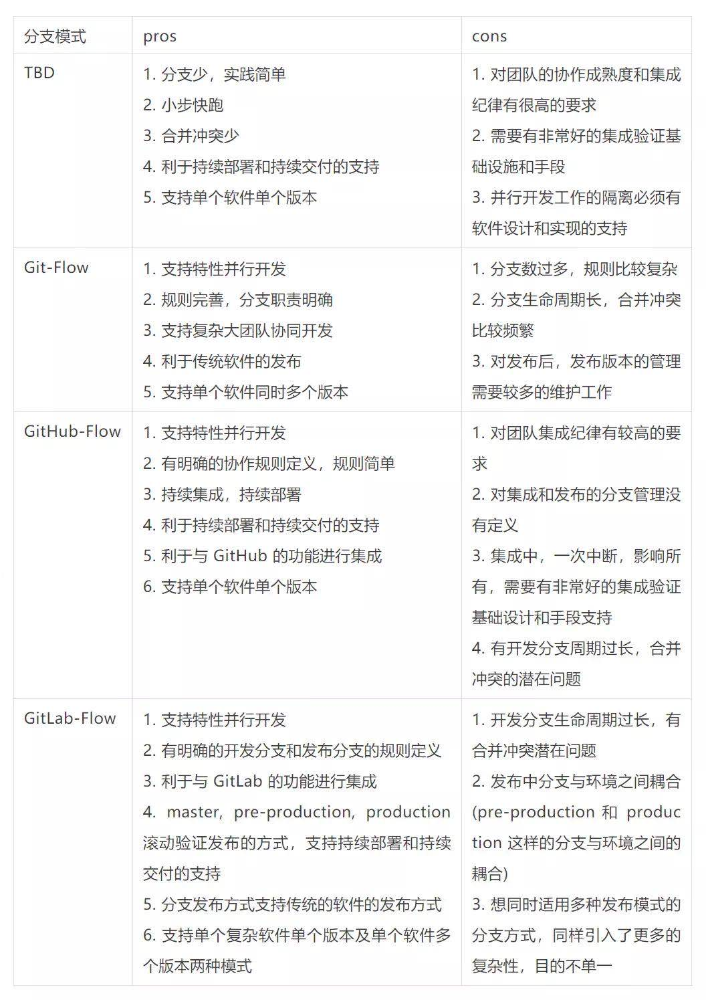

# Git 实践

> Git 作为一个源码管理系统，不可避免涉及到多人协作。
>
> 协作必须有一个规范的工作流程，让大家有效地合作，使得项目井井有条地发展下去。"工作流程"在英语里，叫做"workflow"或者"flow"，原意是水流，比喻项目像水流那样，顺畅、自然地向前流动，不会发生冲击、对撞、甚至漩涡。
>
> 选自[《Git 工作流程》](https://www.ruanyifeng.com/blog/2015/12/git-workflow.html)

[toc]

## flow 有哪些？

### Git flow

Git flow 最主要的特点有两个：长期分支和临时分支。

项目存在两个长期分支

- 主分支`master`
- 开发分支`develop`

前者用于存放对外发布的版本，任何时候在这个分支拿到的，都是稳定的分布版；后者用于日常开发，存放最新的开发版。

其次，项目存在三种临时分支

- 功能分支（feature branch）
- 补丁分支（hotfix branch）
- 预发分支（release branch）

一旦完成开发，它们就会被合并进`develop`或`master`，然后被删除。

- 分支各司其职，覆盖大部分开发场景。
- 预期 master 分支中任何 commit 都是可部署的。
- 严格按照流程执行，出现重大事故的情形会大大降低。

Git flow的优点是清晰可控，缺点是相对复杂，需要同时维护两个长期分支。大多数工具都将`master`当作默认分支，可是开发是在`develop`分支进行的，这导致经常要切换分支，非常烦人。

更大问题在于，这个模式是基于"版本发布"的，目标是一段时间以后产出一个新版本。但是，很多网站项目是"持续发布"，代码一有变动，就部署一次。这时，`master`分支和`develop`分支的差别不大，没必要维护两个长期分支。

### Github flow

GitHub Flow 是一个基于分支的轻量级工作流。它突出了 Code Review 的重要性，有助于我们掌握 Code Review 的开发模式。

> 第一步：根据需求，从`master`拉出新分支，不区分功能分支或补丁分支。
>
> 第二步：新分支开发完成后，或者需要讨论的时候，就向`master`发起一个[pull request](https://help.github.com/articles/using-pull-requests/)（简称PR）。
>
> 第三步：Pull Request既是一个通知，让别人注意到你的请求，又是一种对话机制，大家一起评审和讨论你的代码。对话过程中，你还可以不断提交代码。
>
> 第四步：你的Pull Request被接受，合并进`master`，重新部署后，原来你拉出来的那个分支就被删除。（先部署再合并也可。）

Github flow 的最大优点就是简单，对于"持续发布"的产品，可以说是最合适的流程。

### Gitlab flow

GitLab flow 是 GitLab 的 CEO Sytse Sijbrandij 在 2014 年 9月 29 正式发布出来的。因为出现的比前面两种工作流稍微晚一些，所以它有个非常大的优势，集百家之长，补百家之短。

既支持 Git Flow 的分支策略，也有 GitHub Flow 的 Pull Request（ Merge Request ） 和 issue tracking。

Gitlab flow 的最大原则叫做"上游优先"（upsteam first），即只存在一个主分支`master`，它是所有其他分支的"上游"。只有上游分支采纳的代码变化，才能应用到其他分支。

对于"持续发布"的项目，它建议在`master`分支以外，再建立不同的环境分支。比如，"开发环境"的分支是`master`，"预发环境"的分支是`pre-production`，"生产环境"的分支是`production`。

开发分支是预发分支的"上游"，预发分支又是生产分支的"上游"。代码的变化，必须由"上游"向"下游"发展。比如，生产环境出现了bug，这时就要新建一个功能分支，先把它合并到`master`，确认没有问题，再`cherry-pick`到`pre-production`，这一步也没有问题，才进入`production`。

只有紧急情况，才允许跳过上游，直接合并到下游分支。

对于"版本发布"的项目，建议的做法是每一个稳定版本，都要从`master`分支拉出一个分支，比如`2-3-stable`、`2-4-stable`等等。

以后，只有修补bug，才允许将代码合并到这些分支，并且此时要更新小版本号。

### TBD（Trunk Based Development）

Trunk based Development，又叫 **主干开发** ，是一套代码分支管理策略，开发人员之间通过约定向被指定为 **主干** 的分支提交代码，以此抵抗因为长期存在的多分支导致的开发压力。此举可 **避免分支合并的困扰，保证随时拥有可发布的版本** 。“主干”这个词隐喻了树木生长的场景，树木最粗最长的部位是主干，分支从主干分离出来但是长度有限。

使用主干开发后，我们的代码库原则上就只能有一个 Trunk 分支即 master 分支了，所有新功能的提交也都提交到 master 分支上，保证每次提交后 master 分支都是可随时发布的状态。没有了分支的代码隔离，测试和解决冲突都变得简单，持续集成也变得稳定了许多，但也有如下几个问题：

- 如何避免发布引入未完成 Feature，答案是使用 **Feature Toggle** 。在代码库里加一个特性开关来随时打开和关闭新特性是最容易想到的也是最容易被质疑的解决方案。Feature Toggle 是有成本的，不管是在加 Toggle 时的代码设计，还是在移除 Toggle 时的人力成本和风险，都是需要和它带来的价值进行衡量的。
- 如何进行线上 Bug Fix，答案是在发布时打上 Release Tag，一旦发现这个版本有问题，如果此时 master 分支还没有其他提交，那可以直接在 master 分支上 Hot Fix 然后合并至 release 分支；如果 master 分支已经有了提交就需要做以下4件事： 
  1. 从 Release Tag 创建发布分支。
  2. 在 master 上做 Fix Bug 提交。
  3. 将 Fix Bug 提交 **Cherry Pick** 到 release 分支。
  4. 为 release 分支打上新的 Tag 并做一次发布。

## 方案比较

## 实践方案

> https://juejin.cn/post/6844903890295455751
> https://juejin.cn/post/6992458975367135263
> https://zhangyu.guru/devops/2020/03/09/build-devops-system-from-0-to-1/
> https://www.bookstack.cn/read/gitlab-doc-zh/269836
> https://hackmd.io/@taichunmin/B1TFT8Z9z?print-pdf#/

## 参考

https://drprincess.github.io/2017/12/26/Git%E4%B8%89%E5%A4%A7%E7%89%B9%E8%89%B2%E4%B9%8BWorkFlow(%E5%B7%A5%E4%BD%9C%E6%B5%81)/
https://cloud.tencent.com/developer/article/1500373
https://lucamezzalira.com/2014/03/10/git-flow-vs-github-flow/
https://www.jianshu.com/p/3ceeacab6f2e
https://github.com/xirong/my-git/blob/master/git-workflow-tutorial.md
https://github.com/ecomfe/edp/issues/283
https://cloud.tencent.com/developer/article/1505551
https://www.codercto.com/a/38021.html
https://cn.trunkbaseddevelopment.com/
https://www.git-tower.com/learn/git/ebook/cn/command-line/advanced-topics/git-flow/
https://jeffkreeftmeijer.com/git-flow/
https://www.infoq.cn/article/9dotsvlwscznbxjpxfqe
https://www.cnblogs.com/xueweihan/p/13524162.html
https://zepel.io/blog/5-git-workflows-to-improve-development/
https://www.ruanyifeng.com/blog/2015/12/git-workflow.html
https://guides.github.com/introduction/flow/index.html
https://juejin.cn/post/6875874533228838925#heading-3

